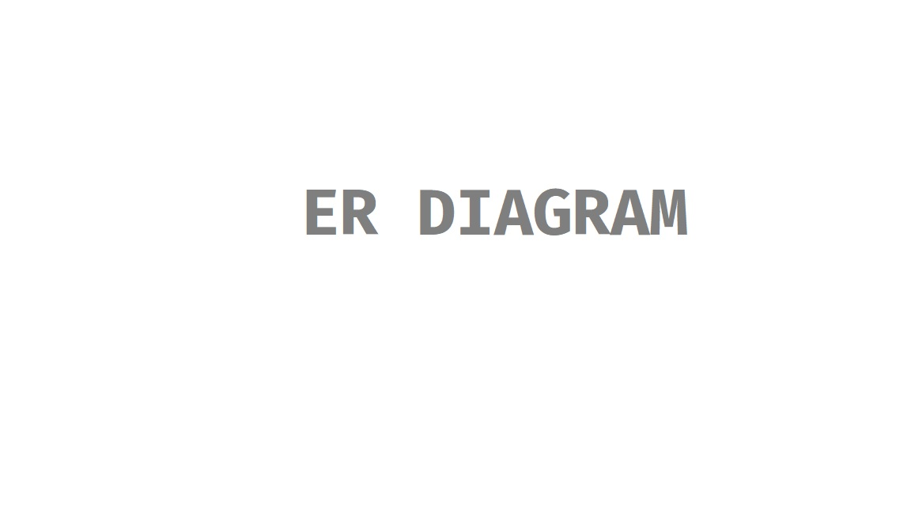

# **HEALTHPLUS**
Online booking system that manages healthcare related services with the convenience of BookMyShow or Amazon.

Similar Services: practo.com, lybrate.com,myupchar.com.
### **1.ONLINE APPOINTMENT BOOKING SYSTEM**
A doctor/lab service booking system provides its customers the ability to purchase appointments online. E-appointment systems allow the customers to browse through doctors within their region with speciality and experience and ratings based on previous user reviews and book appointments anywhere anytime.
### **2. REQUIREMENTS AND GOALS OF THE SYSTEM**
Our appointment booking service should meet the following requirements:

**Functional Requirements:**

1. Our appointment booking service should be able to list different cities where its affiliate health practitioners are located.
1. Once the user selects the city, the service should display the practitioners available in that particular city.
1. Once the user selects a speciality, the service should display the qualified doctors/hospitals and the doctor specific available appointment times.
1. The user should be able to choose a doctor at a particular hospital/clinic and book their appointments.
1. The service should be able to show the user the timings availability of the clinic or hospital. The user should be able to select time slots according to their preference.
1. The user should be able to distinguish available timings from booked ones.
1. Users should be able to put a hold on the appointment for five minutes before they make a payment to finalize the booking.
1. The user should be able to wait if there is a chance that the appointments might become available, e.g., when holds by other users expire.
1. Waiting customers should be serviced in a fair, first come, first serve manner.

**Non-Functional Requirements:**

1. The system would need to be highly concurrent. There will be multiple appointment booking requests for the same time slots at any particular point in time. The service should handle this gracefully and fairly.
1. The core thing of the service is appointment booking, which means financial transactions. This means that the system should be secure and the database ACID compliant.
1. There are a lot of software requirements specifications included in the non-functional requirements of the Appointment Booking System, which contains various processes, namely Security, Performance, Maintainability, and Reliability.
1. Security:

● Patient Identification: The system needs the patient to recognize herself or himself using the phone.

● Logon ID: Any users who make use of the system need to hold a Logon ID and password.

● Modifications: Any modifications like insert, delete, update, etc. for the database can be synchronized quickly and executed only by the ward administrator.

● Front Desk Staff Rights: The staff at the front desk can view any data in the Hospital Management system, and add new patients record to the HMS but they don't have any rights to alter any data in it.

● Administrator rights: The administrator can view as well as alter any information in the Appointment Booking System.

1. Performance:

● Response Time: The system provides acknowledgment in just one second once the 'patient's information is checked.

● Capacity: The system needs to support at least 1000 people at once.

● User-Interface: The user interface acknowledges within five seconds.

● Conformity: The system needs to ensure that the guidelines of the Microsoft accessibilities are followed.

1. Maintainability:

● Back-Up: The system offers efficiency for data backup.

● Errors: The system will track every mistake as well as keep a log of it.

1. Reliability:

● Availability: The system is available all the time.
### **3. SOME DESIGN CONSIDERATIONS**
1. For simplicity, let’s assume our service does not require any user authentication.
1. The system will not handle telephonic appointment orders. Either user books by internet or the staff logs the booking based on the telephone conversation thus occupying the slot.
1. Fairness is mandatory for the system.
1. To stop system abuse, we can restrict users from booking more than one appointment at a time.
1. We can assume that traffic would spike on flu season or viral endemic outbreak and the appointments would fill up pretty fast. The system should be scalable and highly available to keep up with the surge in traffic.
### **4. CAPACITY ESTIMATION**
**Traffic estimates:** Let’s assume that our service has 1 million(1 Cr,1,000,000) page views per month and handles 30 thousand(30,000) appointments a month.

**Storage estimates:** Let’s assume that we have 20 cities and, on average each city has 300 hospital/clinics/doctors. If there are 36 time slots with each service provider and on average, there are two shifts every day.

Let’s assume each slot booking needs 50 bytes (IDs, NumberOfAppointments, AppointmentID, ServiceProviderID, AppointmentNumbers, AppointmentStatus, Timestamp, etc.) to store in the database. We would also need to store information about doctors and clinics; let’s assume it’ll take 50 bytes. So, to store all the data about all appointments of all clinics of all cities for a day:

 $$\color{orange}{20 cities * 300 clinics * 30 slots * 2 shifts * (50+50) bytes = 34.33MB / day}$$


To store five years of this data, we would need around 62.65GB.
### **5. SYSTEM APIs**
We can have SOAP or REST APIs to expose the functionality of our service. The following could be the definition of the APIs to search doctors and reserve slots.

SearchDoctors(api\_dev\_key, keyword, city, lat\_long, radius, start\_datetime, end\_datetime, postal\_code,

includeSpellcheck, results\_per\_page, sorting\_order)

**Parameters:**
**api\_dev\_key (string):** The API developer key of a registered account. This will be used to, among other things, throttle users based on their allocated quota.
**keyword (string):** Keyword to search on.
**city (string):** City to filter health service provider by.
**lat\_long (string):** Latitude and longitude to filter by. **radius (number):** Radius of the area in which we want to search for availibility.
**start\_datetime (string):** Filter HSP with a starting datetime.
**end\_datetime (string):** Filter HSP with an ending datetime.
**postal\_code (string):** Filter HSP by postal code / zipcode.
**includeSpellcheck (Enum: “yes” or “no”):** Yes, to include spell check suggestions in the response.
**results\_per\_page (number):** Number of results to return per page. Maximum is 30.
**sorting\_order (string):** Sorting order of the search result. Some allowable values : ‘rating,asc’, ‘rating,desc’, ‘date,asc’, ‘date,desc’, ‘distance,asc’, ‘type,date,asc’, ‘type,date,desc’, ‘date,type,asc’, ‘date,type,desc’.

**Returns: (JSON)**
Here is a sample list of HSP and their AppointmentSlots:
```json
[

    {

        "id": 174,

        "fname": "Doctor",

        "sname": "Phil",

        "sal_name": "Dr",

        "spec_name": "Obstetrician-gynecologist",

        "bio": "Additional Information.",

        "img_url": "/Images/ProfilePictures/Default/doctor-default.png",

        "max_bok_day": 60,

        "city_name": "Pune",

        "email": "phil@hsp.com",

        "tel": "0884719728",

        "ful_name": "Doctor Phil",

        "first_avl_day": "2020-12-06T00:00:00"

    },

    {

        "id": 149,

        "fname": "Doctor",

        "sname": "Who",

        "sal_name": "Dr",

        "spec_name": "Allergist",

        "bio": "Additional Information.",

        "img_url": "/Images/ProfilePictures/Stefani.jpg",

        "max_bok_day": 60,

        "city_name": "Mumbai",

        "email": "who@hsp.com",

        "tel": "0887867421",

        "ful_name": "Doctor Who",

        "first_avl_day": "2020-12-01T00:00:00"

    }

]
```

**Parameters:**
**api_dev_key (string):** same as above

|**RESPONSE KEY**|**DESCRIPTION**|
| :- | :- |
|**and d**|Doctor Id|
|**fname**|Doctor's name|
|**sname**|Family name|
|**sal_name**|Title|
|**spec_name**|Name of his specialization|
|**bio**|Biography of the doctor|
|**img_url**|Photo of the doctor|
|**max_bok_day**|Maximum number of days ahead in which an appointment can be reserved with the specific doctor|
|**city_name**|City where the doctor works|
|**email**|e-mail to contact the doctor|
|**tel**|Phone number to contact the doctor|
|**full_name**|Doctor's full name|
|**first_avl_day**|First available date to reserve an appointment|

**Returns:** (JSON)
Returns the status of the appointment, which would be one of the following: 1) “Appointment Successful” 2) “Appointment Failed – Slot Full,” 3) “Appointment Failed – Retry, as other users are holding reserved slots”.
### **6. DATABASE DESIGN**
Here are a few observations about the data we are going to store:

1. Each City can have multiple Clinics.
1. Each Clinic will have multiple doctors.
1. Each Doctor will have many shifts and each shift will have multiple Bookings.
1. A doctor can have multiple bookings.


### **7. HIGH LEVEL DESIGN**
At a high-level, our web servers will manage users’ sessions and application servers will handle all the appointment management, storing data in the databases as well as working with the cache servers to process appointments.


### **8. DETAILED COMPONENT DESIGN**
Considering our service is being served from a single server.

**Appointment Booking Workflow:** The following would be a typical appointment booking workflow:

1. The user searches for a doctor.
1. The user selects a doctor.
1. The user is shown the available slots of the doctor.
1. The user selects a slot to be reserved
1. If the required time slot is available, the user is shown a chart of available slots. If not, the user is taken to ‘step 8’ below.
1. Once the user selects the slot, the system will try to reserve the selected slot.
1. If slot can’t be reserved, we have the following options:
- Appointment is full; the user is shown the error message.
- The slot the user wants to reserve are no longer available, but there are other slot available, so the user is taken back to the time chart to choose different slots.
- There are no slots available to reserve, but all the slots are not booked yet, as there are some slots that other users are holding in the reservation pool and have not booked yet. The user will be taken to a waiting page where they can wait until the required slots get freed from the reservation pool. This waiting could result in the following options:
  - If the required number of slots become available, the user is taken to the booking page where they can choose slots.
  - While waiting, if all slots get booked in the reservation pool, the user is shown the error message.
  - User cancels the waiting and is taken back to the doctor search page.
  - At maximum, a user can wait one hour, after that user’s session gets expired and the user is taken back to the doctor search page.
9. If slots are reserved successfully, the user has five minutes to pay for the reservation. After payment, booking is marked complete. If the user is not able to pay within five minutes, all their reserved slots are freed to become available to other users.


**How would the server keep track of all the active appointments that haven’t been booked yet? And how would the server keep track of all the waiting customers?**
We need two daemon services, one to keep track of all active reservations and remove any expired reservation from the system; let’s call it **ActiveReservationService**. The other service would be keeping track of all the waiting user requests and, as soon as the required number of slots become available, it will notify the (the longest waiting) user to choose the slots; let’s call it **WaitingUserService**.


**a. ActiveReservationsService**

We can keep all the reservations of a ‘show’ in memory in a data structure similar to [Linked HashMap](https://docs.oracle.com/javase/7/docs/api/java/util/LinkedHashMap.html) or a [TreeMap](https://docs.oracle.com/javase/6/docs/api/java/util/TreeMap.html) in addition to keeping all the data in the database. We will need a linked HashMap kind of data structure that allows us to jump to any reservation to remove it when the booking is complete. Also, since we will have expiry time associated with each reservation, the head of the HashMap will always point to the oldest reservation record so that the reservation can be expired when the timeout is reached.

To store every reservation for every show, we can have a HashTable where the ‘key’ would be ‘ID’ and the ‘value’ would be the Linked HashMap containing ‘BookingID’ and creation ‘Timestamp’.

In the database, we will store the reservation in the ‘Booking’ table and the expiry time will be in the Timestamp column. The ‘Status’ field will have a value of ‘Reserved (1)’ and, as soon as a booking is complete, the system will update the ‘Status’ to ‘Booked (2)’ and remove the reservation record from the Linked HashMap of the relevant show. When the reservation is expired, we can either remove it from the Booking table or mark it ‘Expired (3)’ in addition to removing it from memory.

ActiveReservationsService will also work with the external financial service to process user payments. Whenever a booking is completed, or a reservation gets expired, WaitingUsersService will get a signal so that any waiting customer can be served.

ActiveReservationsService keeping track of all active reservations

**b. WaitingUsersService**

Just like ActiveReservationsService, we can keep all the waiting users of a show in memory in a Linked HashMap or a TreeMap. We need a data structure similar to Linked HashMap so that we can jump to any user to remove them from the HashMap when the user cancels their request. Also, since we are serving in a first-come-first-serve manner, the head of the Linked HashMap would always be pointing to the longest waiting user, so that whenever slots become available, we can serve users in a fair manner.

We will have a HashTable to store all the waiting users for every Show. The ‘key’ would be 'DoctorID, and the ‘value’ would be a Linked HashMap containing ‘UserIDs’ and their wait-start-time.

Clients can use [Long Polling](https://en.wikipedia.org/wiki/Push_technology#Long_polling) for keeping themselves updated for their reservation status. Whenever slots become available, the server can use this request to notify the user.

**Reservation Expiration**
On the server, ActiveReservationsService keeps track of expiry (based on reservation time) of active reservations. As the client will be shown a timer (for the expiration time), which could be a little out of sync with the server, we can add a buffer of five seconds on the server to safeguard from a broken experience, such that the client never times out after the server, preventing a successful purchase.
### **9. CONCURRENCY**
**How to handle concurrency, such that no two users are able to book same time slot.** We can use transactions in SQL databases to avoid any clashes. For example, if we are using an SQL server we can utilize [Transaction Isolation Levels](https://docs.microsoft.com/en-us/sql/odbc/reference/develop-app/transaction-isolation-levels) to lock the rows before we can update them. Here is the sample code:
```mysql
SET TRANSACTION ISOLATION LEVEL SERIALIZABLE;

BEGIN TRANSACTION;

/*Check for any existing bookings that overlap with period of 10am-11pm*/

SELECT COUNT * FROM bookings_table WHERE room_id = 897 AND meeting_end_time > ‘2020–04–20 10:00’ AND start_time < ‘2020–04–20 11:00’;

/*If the previous query returned zero*/

INSERT INTO bookings (room_id, start_time, end_time, user_id) VALUES (123, ‘2015–01–01 12:00’, ‘2015–01–01 13:00’, 666);

COMMIT;

COMMIT TRANSACTION;
```

‘Serializable’ is the highest isolation level and guarantees safety from [Dirty](https://en.wikipedia.org/wiki/Isolation_\(database_systems\)#Dirty_reads), [Nonrepeatable](https://en.wikipedia.org/wiki/Isolation_\(database_systems\)#Non-repeatable_reads), and [Phantoms](https://en.wikipedia.org/wiki/Isolation_\(database_systems\)#Phantom_reads) reads. One thing to note here; within a transaction, if we read rows, we get a write lock on them so that they can’t be updated by anyone else.

Once the above database transaction is successful, we can start tracking the reservation in ActiveReservationService.
### **10. FAULT TOLERANCE**
**What happens when ActiveReservationsService or WaitingUsersService crashes?**
Whenever ActiveReservationsService crashes, we can read all the active reservations from the ‘Booking’ table. Remember that we keep the ‘Status’ column as ‘Reserved (1)’ until a reservation gets booked. Another option is to have a main-child configuration so that, when the main crashes, the child can take over. We are not storing the waiting users in the database, so, when WaitingUsersService crashes, we don’t have any means to recover that data unless we have a main-child setup.

Similarly, we’ll have a main-child setup for databases to make them fault tolerant.
### **11. DATA PARTITIONING**
**Database partitioning:** If we partition by ‘CityID’, then all the slots of a doctor will be on a single server. For a very hectic flu season, this could cause a lot of load on that server. A better approach would be to partition based on DoctorID; this way, the load gets distributed among different servers.

**ActiveReservationService and WaitingUserService partitioning:** Our web servers will manage all the active users’ sessions and handle all the communication with the users. We can use the Consistent Hashing to allocate application servers for both ActiveReservationService and WaitingUserService based upon the ‘DoctorID’. This way, all reservations and waiting users of a particular doctor will be handled by a certain set of servers. Let’s assume for load balancing our [Consistent Hashing](https://www.educative.io/collection/page/5668639101419520/5649050225344512/5709068098338816) allocates three servers for any city, so whenever a reservation is expired, the server holding that reservation will do the following things:

1. Update database to remove the Booking (or mark it expired) and update the slots’ Status in ‘Show\_Slots’ table.
1. Remove the reservation from the Linked HashMap.
1. Notify the user that their reservation has expired.
1. Broadcast a message to all WaitingUserService servers that are holding waiting users of that Show to figure out the longest waiting user. Consistent Hashing scheme will tell what servers are holding these users.
1. Send a message to the WaitingUserService server holding the longest waiting user to process their request if required slots have become available.

Whenever a reservation is successful, following things will happen:

1. The server holding that reservation sends a message to all servers holding the waiting users of that doctor\_slot, so that those servers can expire all the waiting users that need more slots than the available slots.
1. Upon receiving the above message, all servers holding the waiting users will query the database to find how many free slots are available now. A database cache would greatly help here to run this query only once.
1. Expire all waiting users who want to reserve more slots than the available slots. For this, WaitingUserService has to iterate through the Linked HashMap of all the waiting users.

### **12.HARDWARE REQUIREMENTS**

Minimum requirements:

- A server with at least 4GB of RAM
- A quad-core processor
- At least 100GB of storage
- A reliable internet connection

However, if the application will be handling large amounts of data or serving a large number of users, more powerful hardware may be necessary.

Additionally, it is important to consider the need for data backup and disaster recovery, as well as compliance with any relevant industry regulations.

For a large-scale, complex healthcare web application in Java, the hardware requirements may be more demanding to handle the increased traffic and data processing.

Minimum requirements:

- A server with at least 8GB of RAM, more if the application handles a large amount of data or have a large number of concurrent users.
- A multi-core processor, preferably octa-core or better.
- At least 200GB of storage, more if the application handles a large amount of data.
- A reliable internet connection with a high bandwidth.
- A load balancer to distribute the traffic among multiple servers.
- A highly available and redundant storage solution (SAN,NAS)

Additionally, it is important to consider the need for data backup and disaster recovery, as well as compliance with any relevant industry regulations. You may also want to consider using a cloud-based infrastructure to better handle the scalability and reliability needs of a large-scale application.


